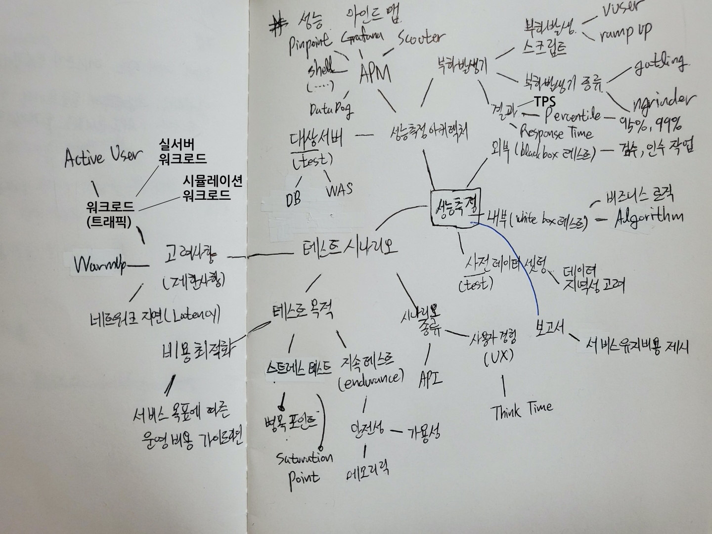

개발한 API를 운영에 배포할 때, 유료 마케팅, 이벤트를 할 때 과연 서버가 버틸 수 있을까? 혹은 스타트업에서 서버 운영 비용이 너무 큰 것 같은데 최적화할 수 있을까? 등등 서버 개발자라면 누구나 한 번쯤은 고민해본 주제일 것입니다. 
이럴 때 성능측정, 성능튜닝을 통해 시스템의 병목 지점을 체크하고 가성비 좋게 개선할 수 있는데요. 자꾸 까먹다보니 기억나는 선에서 정리해두고자 합니다.

대략 머릿 속의 생각들을 마인드맵으로 정리했고 각 세부사항들을 정리해보려고 합니다.

# Performance Tuning
## 성능측정 마인드맵
